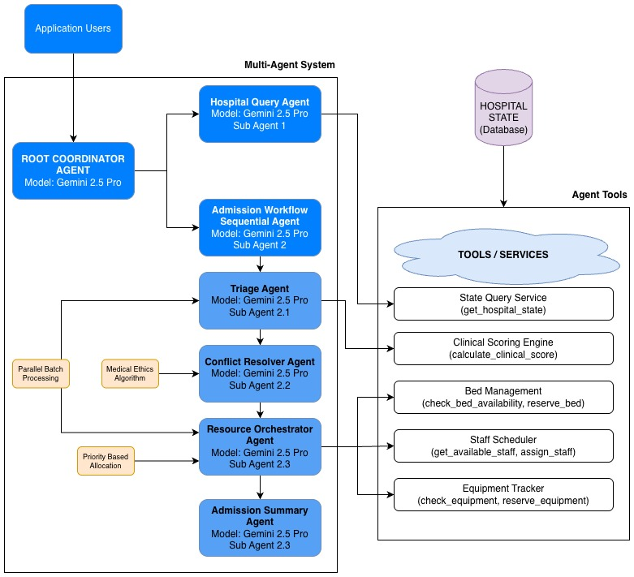

# MedFlow: AI-Powered Emergency Department Resource Orchestration

[](https://www.python.org/downloads/)
[](https://developers.google.com)

> Intelligent multi-agent system for real-time emergency department resource allocation with automated conflict resolution.

## 🎯 Overview

**MedFlow** is an advanced AI-powered hospital resource orchestration system designed to handle complex emergency scenarios including mass casualty events, resource conflicts, and critical care prioritization. Built on Google's Agent Development Kit (ADK), it uses a coordinated multi-agent architecture to triage patients, resolve resource conflicts, and optimize hospital capacity in real-time.

## 🏗️ Architecture



### Key Features

- **Intelligent Batch Triage**: Simultaneously assess multiple patients using clinical scoring algorithms
- **Automated Conflict Resolution**: Medical ethics-based prioritization when resources are scarce
- **Dynamic Resource Allocation**: Real-time bed, staff, and equipment management
- **Hospital State Monitoring**: Live capacity tracking and availability queries
- **Mass Casualty Support**: Handle multiple critical patients with optimal resource distribution
- **Clinical Scoring**: APACHE-like severity assessment for objective triage decisions

---

### Agent Responsibilities

| Agent | Model | Purpose |
|-------|-------|---------|
| **Batch Triage Coordinator** | Gemini 2.5 Pro | Assess all patients independently, calculate clinical scores |
| **Conflict Resolution Coordinator** | Gemini 2.5 Pro | Prioritize patients when resources are limited |
| **Batch Resource Orchestrator** | Gemini 2.5 Pro | Allocate beds, staff, equipment in priority order |
| **Admission Summarizer** | Gemini 2.5 Pro | Generate executive summaries for leadership |
| **Hospital Query Agent** | Gemini 2.5 Flash | Answer real-time capacity and availability queries |

---

## 🚀 Quick Start

### Prerequisites

```bash
pip install google-adk pydantic
```

### Installation

```bash
# Clone the repository
git clone https://github.com/yourusername/medflow.git
cd medflow

# Install dependencies
pip install -r requirements.txt
```

### Basic Usage

```bash
adk web
```

---

## 📋 Sample Scenarios

### Scenario 1: Resource Conflict (2 Critical Patients, 1 ICU Bed)

**Input:**
```python
patients = [
    {
        "name": "Patricia Wilson",
        "age": 72,
        "chief_complaint": "Respiratory failure, COPD exacerbation",
        "vital_signs": {"heart_rate": 115, "bp_systolic": 150, "oxygen_saturation": 84},
        "symptoms": ["severe respiratory distress", "unable to speak", "using accessory muscles"],
        "medical_history": ["COPD", "CHF", "Previous ICU admissions"],
        "note": "Needs ICU bed and ventilator URGENTLY"
    },
    {
        "name": "James Thompson",
        "age": 58,
        "chief_complaint": "Massive MI, cardiogenic shock",
        "vital_signs": {"heart_rate": 128, "bp_systolic": 78, "oxygen_saturation": 90},
        "symptoms": ["chest pain", "cardiogenic shock", "needs immediate cath lab"],
        "medical_history": ["Diabetes", "Smoker"],
        "note": "Needs ICU bed for post-cath monitoring - only 1 ICU bed available!"
    }
]
```

**System Response:**
- **Triage**: Both patients scored CRITICAL
- **Conflict Detection**: 2 patients need ICU, only 1 bed available
- **Resolution**: James Thompson prioritized (higher survival probability with intervention)
- **Allocation**: 
  - James --> ICU-3 immediately
  - Patricia --> ED Trauma Bay with ventilator support, ICU transfer when available

---

### Scenario 2: Mass Casualty Event (4 Trauma Patients)

**Input:**
```python
mass_casualty_patients = [
    {
        "name": "John Davis",
        "age": 42,
        "chief_complaint": "Head trauma, unresponsive",
        "vital_signs": {"heart_rate": 135, "bp_systolic": 85, "oxygen_saturation": 88, "gcs": 6},
        "symptoms": ["head trauma", "unresponsive", "severe bleeding"],
        "mechanism": "Bus accident - ejected from vehicle"
    },
    {
        "name": "Sarah Johnson",
        "age": 35,
        "chief_complaint": "Multiple fractures, conscious",
        "vital_signs": {"heart_rate": 105, "bp_systolic": 110, "oxygen_saturation": 95},
        "symptoms": ["leg fractures", "severe pain", "conscious and alert"],
        "mechanism": "Bus accident - pinned in seat"
    },
    {
        "name": "Michael Chen",
        "age": 28,
        "chief_complaint": "Chest trauma, difficulty breathing",
        "vital_signs": {"heart_rate": 125, "bp_systolic": 95, "oxygen_saturation": 89},
        "symptoms": ["chest pain", "respiratory distress", "possible pneumothorax"],
        "mechanism": "Bus accident - steering wheel impact"
    },
    {
        "name": "Emily Rodriguez",
        "age": 19,
        "chief_complaint": "Abdominal pain, internal bleeding suspected",
        "vital_signs": {"heart_rate": 118, "bp_systolic": 88, "oxygen_saturation": 93},
        "symptoms": ["abdominal pain", "rigid abdomen", "signs of shock"],
        "mechanism": "Bus accident - seatbelt injury"
    }
]
```

**System Response:**
- **Triage**: 4 patients simultaneously assessed
- **Priority Order**:
  1. John Davis (CRITICAL - head trauma, GCS 6)
  2. Emily Rodriguez (CRITICAL - internal bleeding)
  3. Michael Chen (EMERGENCY - chest trauma)
  4. Sarah Johnson (URGENT - stable fractures)
- **Resource Allocation**:
  - John --> ICU-3 + Trauma Surgeon + Ventilator
  - Emily --> Trauma Bay TB-2 + ED Physician
  - Michael --> Trauma Bay TB-3 + Cardiac Monitor
  - Sarah --> ED Treatment Room + Orthopedic consult

---

## 🛠️ Core Components

### Clinical Scoring System

```python
def calculate_clinical_score(age, vital_signs, symptoms):
    """
    APACHE-like clinical severity scoring (0-20 scale)
    
    Factors:
    - Age adjustment (0-3 points)
    - Heart rate deviation (0-3 points)
    - Blood pressure (0-4 points)
    - Oxygen saturation (0-5 points)
    - Critical symptoms (0-4 points each)
    
    Returns: clinical_score, severity, survival_probability
    """
```

### Resource Management Tools

| Tool | Purpose | Returns |
|------|---------|---------|
| `get_hospital_state()` | Query current capacity | Beds, staff, equipment availability |
| `check_bed_availability()` | Check specific department | Available beds with wait times |
| `get_available_staff()` | Find least-busy staff | Sorted staff list by workload |
| `reserve_bed()` | Lock bed for patient | Reservation confirmation |
| `reserve_equipment()` | Allocate equipment | Updated availability |
| `assign_staff()` | Assign staff to patient | Updated workload |

---

## 📊 Data Models

### TriageDecision
```python
{
    "patient_name": "Patricia Wilson",
    "priority_level": "CRITICAL",
    "clinical_score": 14,
    "survival_probability": 65.0,
    "recommended_department": "ICU",
    "required_specialists": ["Pulmonologist", "Intensivist"],
    "required_tests": ["ABG", "Chest X-ray"],
    "max_wait_time_minutes": 10,
    "clinical_reasoning": "Critical COPD exacerbation with respiratory failure..."
}
```

### ConflictResolution
```python
{
    "total_patients": 2,
    "allocation_order": [
        {
            "patient_name": "James Thompson",
            "allocation_order": 1,
            "priority_level": "CRITICAL",
            "clinical_score": 16,
            "justification": "Cardiogenic shock - highest survival probability with immediate intervention"
        },
        {
            "patient_name": "Patricia Wilson",
            "allocation_order": 2,
            "priority_level": "CRITICAL",
            "clinical_score": 14,
            "justification": "COPD exacerbation - can be managed in ED temporarily"
        }
    ],
    "conflict_type": "ICU_bed_shortage",
    "resolution_strategy": "Prioritized MI patient for ICU, COPD patient to ED with ventilator",
    "clinical_rationale": "MI patient has higher survival probability with immediate ICU care..."
}
```

---

## 🔍 Hospital State Queries

```python
# Get full hospital snapshot
"Give me the latest HOSPITAL_STATE"

# Specific queries
"Which ICU beds are available?"
"Who are the least busy physicians?"
"How many ventilators are free?"
"What's our current capacity status?"
```

**Response Format:**
```
HOSPITAL STATE SNAPSHOT - 2024-10-30T14:30:00

BEDS:
ICU: 2 available (ICU-3, ICU-4), 2 occupied - 50% occupancy
Trauma Bays: 2 available (TB-2, TB-3)
ED Treatment: 5 rooms available

STAFF:
Physicians: Dr. Jones (load: 2), Dr. Smith (load: 3)
Nurses: RN Davis (2 patients), RN Williams (3), RN Johnson (4)
Specialists: All available

EQUIPMENT:
Ventilators: 2/7 available
Cardiac Monitors: 8/15 available
Defibrillators: 6/8 available

ALERTS: None

OVERALL CAPACITY: Normal
```

---

## 🎓 Medical Ethics & Prioritization

MedFlow follows established medical triage principles:

1. **Greatest Good for Greatest Number**: Maximize overall survival
2. **Clinical Severity First**: Most critical patients get priority
3. **Survival Probability**: Higher chance of survival with intervention
4. **Time Sensitivity**: Account for safe wait times
5. **Transparency**: Document all prioritization decisions

### Conflict Resolution Criteria

```python
# Priority calculation (pseudocode)
priority_score = (
    clinical_score * 0.4 +              # Severity
    survival_probability * 0.3 +        # Outcome likelihood
    (1 / max_wait_time) * 0.2 +         # Time sensitivity
    age_adjustment * 0.1                # Age factor
)
```

---

## 📈 Performance Metrics

### Time Comparison: Traditional vs. MedFlow System

| Scenario | Traditional Manual Process | MedFlow AI System |
|----------|---------------------------|-------------------|
| **Single Patient Admission** | **15 minutes** | **1-2 minutes** |
| **2 Patients with Resource Conflict** | **30-50+ minutes** | **<3 miuntes** |
| **Mass Casualty (8 Patients)** | **60-110+ minutes** | **<5 minutes** |

### Bottleneck Analysis

| Process Step | Traditional Bottleneck | MedFlow Solution |
|--------------|------------------------|------------------|
| **Patient Assessment** | One-by-one evaluation | Simultaneous batch processing |
| **Bed Availability** | Phone calls to multiple departments | Real-time database query |
| **Resource Conflicts** | Committee meetings/escalation | Automated ethical prioritization |
| **Staff Assignment** | Manual coordination | Workload-optimized allocation |
| **Documentation** | Retrospective, incomplete | Real-time, comprehensive |

---

<div align="center">
Developed by Sagar Maheshwari<br>
⭐ Star this repo if you find it useful!<br>
Made with Google ADK | Gemini 2.5 Pro | Python<br>
</div>